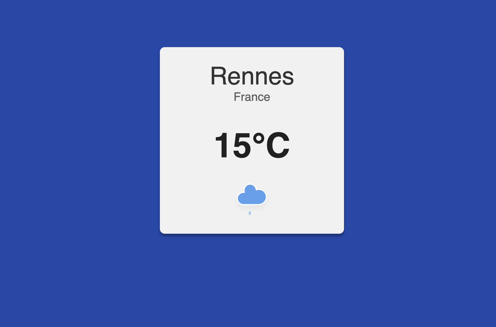

# 🌤️ Weather App

A simple and responsive weather application built with **React**. This project was developed during a formation "Ecole du web" to strengthen my front-end development skills and work with APIs.

## 📖 Description

This project fetches and displays the nearest city's weather using the [IQAir AirVisual API](https://www.iqair.com/). It handles loading states, displays an error message if the API call fails, and shows current weather conditions (city, country, temperature, icon).

## 🚀 Features

- 📍 Detects and fetches weather for your current location
- 🌡️ Displays city, country, temperature, and weather icon
- 🔄 Loading animation while fetching data
- ⚠️ Error message and fallback icon when data cannot be fetched

## 🛠️ Tech Stack

- **React** with functional components & hooks
- **Vite** for fast development build
- **IQAir API** for weather and air quality
- CSS (custom) for styling
- SVG assets for loader and icons

## 📦 Installation

```bash
git clone https://github.com/your-username/react-weather.git
cd PP-weather--react
npm install
```

### 🔐 Configuration

Create a .env file at the root of your project and add your API key:

```
.env
VITE_WEATHER_API_KEY=your_api_key_here
```

You can get a free key from [IQAir AirVisual](https://www.iqair.com/).

### ▶️ Usage

Start the app in development mode:

```bash
npm run dev
```

## 🧠 What I learned

- Using React hooks (useEffect, useState) to fetch and display API data
- Managing asynchronous API calls and errors
- Handling loading and error UI states
- Using environment variables with Vite
- Creating a simple, clean user interface with SVG icons

## 🖼️ Screenshots


